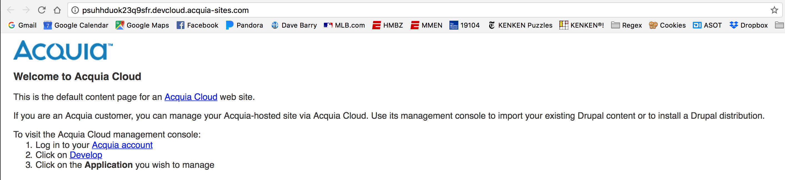
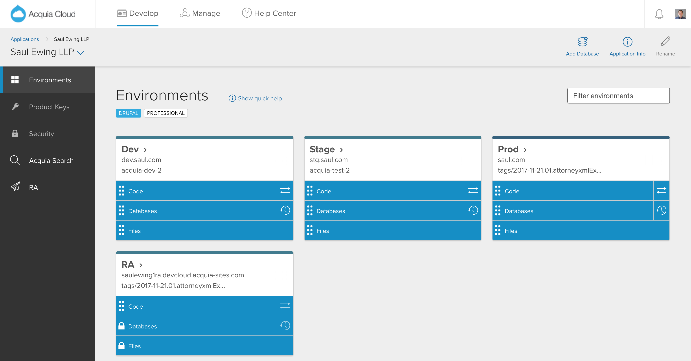
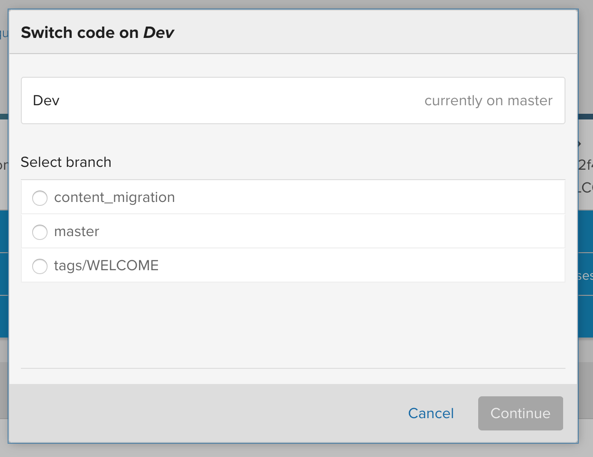
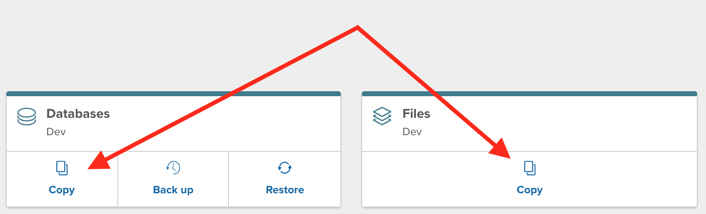

# Acquia Introduction

Acquia provides a robust three-tier environment that is tied directly to the `master` branch of the git repo provisioned when the project is created. Unlike [Pantheon](pantheon.md), Acquia does not provide any means of creating additional environments outside of the "dev", "stage", and "prod" environments.

When an Acquia application is initially provisioned, each environment is set to show only a "Welcome" screen:

This screen is taken from the initial commit of the repo. It is considered best practice to leave this screen as the default for any environment that is not launch-ready, since Acquia provisions and enables all three environments immediately.

# Technical Information: How does Acquia power three environments from the same repo?

Acquia provides a great amount of flexibility when it comes to which commit on the repo powers each of the three environments. All three environments can be based on either the `HEAD` commit of any branch, or on any tag in the repo. The following screenshot shows a mix of branches and tags being used to power the three environments:

For most projects, it is considered best practice to start with the environments configured this way:

* **Dev**: track `master` branch
* **Stage**: track `tags/WELCOME` \(shows the "Welcome" screen as demonstrated above\)
* **Prod**: track `tags/WELCOME`

> #### info::What's that RA environment?
>
> Acquia provides a fourth "environment" called "RA," which stands for "Remote Administration." The RA environment is where Acquia automatically applies Drupal core updates and module security updates to a clone of the production instance. This allows core and module updates to be tested in an "production-like" environment without impacting ongoing development work. Acquia automatically creates this branch and applies the file changes:
>
> 
>
> This branch can be merged into any other branch to include the updates. Because it is an automated branch, this document will not include it as part of the "three-tier" discussion. For more information on the RA environment, see the [Acquia documentation](https://docs.acquia.com/ra/environment).

# Initial Git Workflow

At the initial creation of project, a repo will be provisioned. Developers should check this repo out to being their work. At the start of a project, all work should be done directly on the `master` branch since the initial work is generally things like settup up modules, features, configuration, etc. As soon as there is a stable Drupal installation available, the configuration \(and database, if necessary\) should be copied up to Acquia and the "dev" environment should be set to track the `master` branch:

Once multiple developers are working on the project, developers should switch to using feature branches and merging into `master` at the conclusion of the work on that branch. This feature branch workflow minimizes the risk of merge conflicts directly on the `master` branch. It is recommended that developers keep their feature branches small to minimize the risk of divergance.

# Git Workflow from Beta Handoff/Content Entry to Pre-Launch

Prior to the client being allowed into the site, the files and database from the "dev" environment should be copied into the "stage" environment:

Once the files and database have been copied, create a tag using the format `yyyy.mm.dd-nn.short-description`, eg. `2018.03.09-02.favicon-fix`. Push this tag to the repo and switch the "stage" environment to use that tag.

The client should now do all of the content entry in the "stage" environment. Developers can continue pushing updates to their feature branches and either cherry-picking or merging changes into the `master` branch. Because Acquia does not place any restrictions on branch names, it is recommended that developers always push their feature branches to the Acquia remote.

> #### danger::Important
>
> Once the client has started content entry, fields **must not** be deleted and databases **must not** be copied into the "stage" environment. Only configuration changes, preferably using the [Features](https://www.drupal.org/project/features) module, should be pushed into the "test" environment.

# Git Workflow for Launch

At some point prior to launching the site, the files and database from the "stage" environment should be copied into the "prod" environment as outlined above. A new tag should be created for this release, and the "prod" environment should be switched to using this tag.

Following production launch, the developers should follow git best practices when doing new work:

* For scoped new features, a new feature branch should be created from the "dev" environment and merged into `master` along with any other features as part of a scheduled release.
* For fixes for non-breaking but priority bugs on work that is in the "stage" environment, a new feature branch should be created from the tagged "test" environment release. The developer should then create the fix\(es\), merge that branch into `master`, create a new tag, push the tag, and set the "test" environment to use that tag.
* For hotfixes/breaking bugs in production, a new feature branch should be created from the tagged "prod" environment release. The developer should then create the fix\(es\), merge that branch into `master`, create a new tag, push the tag, and set the "prod" environment to use that tag.

